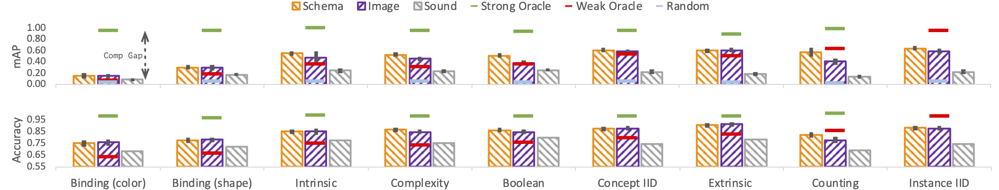

# Productive Concept Learning with the CURI Dataset (ICML 2021)
`
We introduce the productive concept learning task and the CURI dataset,
where few-shot, meta-learners need
to acquire concepts sampled from a structured, productive, compositional space and
generalize, while demonstrating the ability to reason about compositionality
under uncertainty.
`
## Compositional Reasoning Under Uncertainty

**Illustration of Compositional Reasoning Under Uncertainty**

Given images in a support set (left) consistent with two concepts:

1) ``all objects are blue and for all objects the x coordinate is greater
than the y-coordinate''

2) ``all objects are blue there exists
an object such that the x coordinate is greater than the y coordinate''

A model that understands the compositional structure of the space
should first be able to infer that these are concepts which can explain the observed
images, and then reason that the former concept is more likely to explain
the set and make predictions on held out images keeping the relative 
likelihoods of both the scenarios into account. The CURI benchmark tests
such compositional reasoning.

### Systematic Splits and Compositionality Gap (Comp Gap)
Our paper introduces various systematic splits to test different aspects of
productive concept learning. While similar methodologies have been applied to
create datasets and splits in the past, our work is unique in that we also
introduce a notion of a "compositionality gap" which gives an objective, 
model-independent measure of how difficult a given compositional split is.



### Models 
This repository contains an implementation of prototypical networks (Snell et.al.)
with various architectures, input modalities, use of auxiliary information
etc. For more details see our paper:

**“CURI: A Benchmark for Productive Concept Learning Under Uncertainty.”**
arXiv [cs.AI]. arXiv. http://arxiv.org/abs/2010.02855.
*Vedantam, Ramakrishna, Arthur Szlam, Maximilian Nickel, Ari Morcos, and Brenden Lake*
ICML 2021 

----
----
## Setup
Run `source install.sh` to install all the dependencies for the project.

### Download the CURI dataset
Run the following command to download the CURI dataset:

```
wget https://dl.fbaipublicfiles.com/CURI/curi_v0.2.tar.gz -P /path/to/dataset
```
The dataset itself is very large ~200GB after decompressing
so please ensure there is enough storage
where you are downloading it to hold the dataset.

Uncompress the following files:

```
cd /path/to/dataset/curi_release
tar -xvf images_200.tar.gz
tar -xvf scenes_200.tar.gz
```

### Before Training and Evaluating models

Before we train the models we need to set the following two paths in `paths.sh`:

* First set `${RUN_DIR}=/path/to/runs` to set where we want to store the results
of the sweeps on the models.
* Set `${CURI_DATASET_PATH}` variable in file `paths.sh` to `/path/to/dataset/curi_release`
* Run `source paths.sh`

### Training a model
```
python hydra_train.py mode=train
```
runs the training of the model with the default parameters.
The project uses [Hydra](hydra.cc) to manage configuration. Set the
corresponding flags based on the configuration in `hydra_cfg/experiment.yaml`
to run various models of interest.

Run `source launch_train_eval_jobs.sh` to launch a full sweep of models explored
in the paper, and `source launch_test_jobs.sh` to launch a full sweep of test
runs on the models after they train.

## Computing oracle metrics
See `source launch_test_jobs.sh` to see how to compute oracle metrics and the
associated compositionality gap for various splits discussed in the paper.

## Additional Information
### Mapping between the splits in the code and the splits in the paper
The following mapping exists between the splits in the code and the splits 
mentioned in our paper:

| Code                | Paper                   |
|---------------------|-------------------------|
| Color Boolean       | Boolean                 |
| Color Count         | Counting                |
| Color Location      | Extrinsic Disentangling |
| Color Material      | Intrinsic Disentangling |
| Color               | Binding (Color) .       |
| Comp                | Compositional Split     |
| IID                 | IID                     |
| Shape               | Binding (Shape) .       |
| length_threshold_10 | Complexity              |

### Directory Structure
The dataset directory contains the following files:

```
CURI
| --> images
| ---->1
| ------> 1.png
| ------> 2.png
| --> scenes
| ---->1
| ------> 1.json
| ------> 2.json
| --> hypotheses
| ----> hypothesis_property_dir
| ------> split_1.pkl
| ------> split_2.pkl
.
.
```

## License
productive_concept_learning is CC-BY-NC 4.0 licensed, as found in the LICENSE file.
